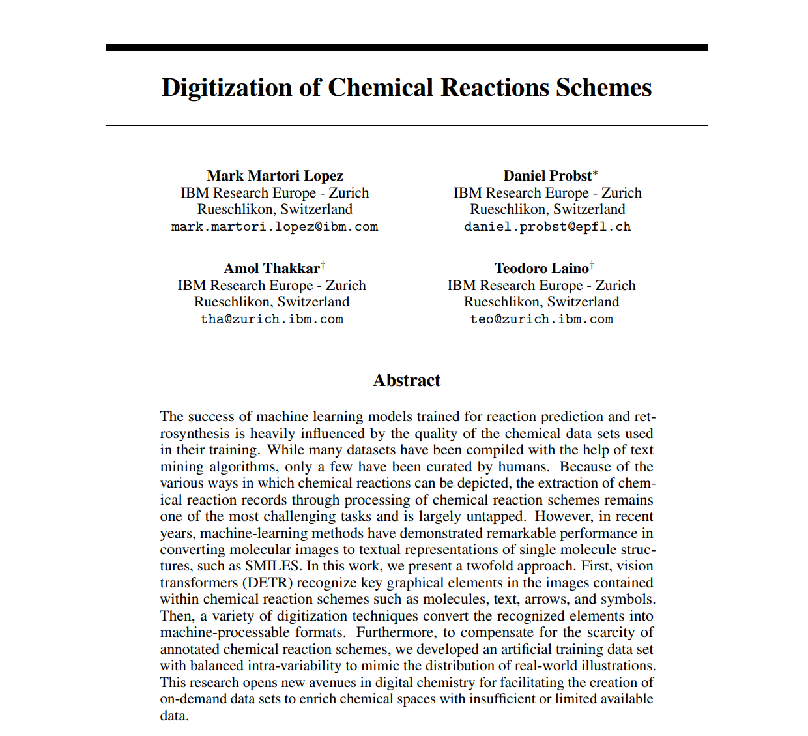

# ELLIS_ML4MoleculeDiscovery_Manuscript
Poster presented at ELLIS Workshop - Machine Learning for Molecule Discovery.

  

  

    Digitize your chemical reaction image into a machine-readable representation.
     
    <a>V.0</a>
    ·
    <a href="https://www.zurich.ibm.com">IBM Research Zurich</a>
  

